# Flujo de casos de uso

## Diagrama de invocación y efectos sobre el dominio

```mermaid
flowchart TB
    subgraph UserInitiated["Casos de uso iniciados por el usuario"]
        direction TB
        UC1[CreateCharacter]:::doc
        UC4[UpdateCharacter]:::doc
        UC17[DeleteCharacter]:::doc
        UC2[CreateConversation]:::doc
        UC3[SendMessage]:::doc
        UC5[EditMessage]:::doc
        UC6[RewindConversation]:::doc
        UC11[RegenerateReply]:::doc
        UC9[ArchiveConversation]:::doc
        UC10[UpdateConversationSettings]:::doc
        UC7[ApplyMemoryChanges]:::doc
        UC18[CreateMemory]:::doc
        UC19[UpdateMemory]:::doc
        UC20[DeleteMemory]:::doc
        UC22[UpdateSummary]:::doc
        UC23[DeleteSummary]:::doc
        UC24[ConfigureDefaultProvider]:::doc
    end

    subgraph SystemInitiated["Casos de uso iniciados por el sistema"]
        direction TB
        UC8[CreateCharacterVersion]:::doc
        UC12[PromptContextBuilder]:::doc
        UC13[GenerateCharacterResponse]:::doc
        UC14[GenerateSummary]:::doc
        UC15[ProposeMemoryChanges]:::doc
        UC16[GenerateConversationTitle]:::doc
    end

    subgraph Entities["Entidades del dominio"]
        Character[Character]
        CharVersion[CharacterVersion]
        CharCard[CharacterCard]
        Conversation[Conversation]
        Message[Message]
        Memory[Memory]
        MemoryProposal[MemoryChangeProposal]
        Summary[Summary]
        Settings[Settings]
        PromptContext[PromptContext]
        GeneratedResponse[GeneratedResponse]
    end

    %% Creación / modificación del personaje
    UC1 -->|crea| Character
    UC1 -->|crea versión inicial| CharVersion
    UC1 -->|crea tarjetas| CharCard
    UC1 -->|crea conversación y greeting| UC2
    UC4 -->|invoca| UC8
    UC4 -->|modifica| Character
    UC8 -->|crea nueva versión| CharVersion
    UC8 -->|copia y reordena tarjetas| CharCard
    UC17 -->|elimina en cascada| Character
    UC17 -.->|cascade| Conversation
    UC17 -.->|cascade| Memory
    UC17 -.->|cascade| Summary
    UC17 -.->|cascade| MemoryProposal

    %% Conversaciones
    UC2 --> Conversation
    UC2 -->|inserta greeting| Message
    UC3 -->|invoca| UC12
    UC3 -->|invoca| UC13
    UC3 -->|invoca| UC14
    UC3 -->|invoca| UC15
    UC3 -->|invoca| UC16
    UC9 --> Conversation
    UC10 --> Conversation

    %% Mensajes: edición / regeneración / retroceso
    UC5 -->|modifica content + editedAt| Message
    UC11 -->|re-invoca| UC12
    UC11 -->|re-invoca| UC13
    UC11 -->|mueve versión previa a alternatives| Message
    UC6 -->|elimina mensajes posteriores| Message
    UC6 -->|elimina resúmenes con rango invalidado| Summary
    UC6 -->|descarta propuestas pending| MemoryProposal

    %% Contexto y generación
    UC12 --> PromptContext
    UC12 --> CharVersion
    UC12 --> CharCard
    UC12 --> Summary
    UC12 --> Memory
    UC12 --> Message
    UC13 --> PromptContext
    UC13 --> GeneratedResponse

    %% Resúmenes
    UC14 --> Summary
    UC14 -->|invoca| UC16
    UC22 -->|modifica| Summary
    UC23 -->|elimina| Summary

    %% Memoria
    UC15 -->|crea propuestas pending| MemoryProposal
    UC7 -->|aplica cambios| Memory
    UC7 -->|marca estado| MemoryProposal
    UC18 -->|crea| Memory
    UC19 -->|modifica| Memory
    UC20 -->|elimina| Memory
    UC20 -.->|set null targetMemoryId| MemoryProposal

    %% Título
    UC16 --> Conversation

    %% Configuración global
    UC24 -->|persiste default_provider / default_model| Settings

    classDef doc fill:#1b5e20,color:#fff,stroke:#2e7d32
    classDef entity fill:#0d47a1,color:#fff,stroke:#1565c0
    class UC1,UC2,UC3,UC4,UC5,UC6,UC7,UC8,UC9,UC10,UC11,UC14,UC15,UC16,UC17,UC18,UC19,UC20,UC22,UC23,UC24 doc
    class Character,CharVersion,CharCard,Conversation,Message,Memory,MemoryProposal,Summary,Settings,PromptContext,GeneratedResponse entity
```

---

## Notas aclaratorias sobre los efectos en el dominio

Los siguientes detalles no se representan gráficamente para no saturar el diagrama, pero son contractuales para la implementación.

### Historial de regeneraciones (`alternatives`)

* `RegenerateReply` mueve el contenido actual del último mensaje `assistant` a su lista `alternatives` y sustituye el `content` por la nueva generación. El historial se conserva hasta que el usuario envía un nuevo mensaje, momento en el que `SendMessage` **limpia automáticamente** la lista `alternatives` del mensaje aceptado.
* `EditMessage` solo actualiza `content` y `editedAt`; **no** toca `alternatives` ni limpia el historial de regeneraciones.
* Las memorias dinámicas, los resúmenes y las propuestas de memoria pendientes **no se alteran** durante `RegenerateReply` ni `EditMessage`.

### Retroceso de conversación (`RewindConversation`)

* Elimina todos los `Message` posteriores al punto seleccionado.
* Elimina los `Summary` cuyo rango (`firstMessageId` o `lastMessageId`) incluye algún mensaje eliminado; los resúmenes cuyo rango se mantiene intacto se conservan.
* **Descarta todas las propuestas `MemoryChangeProposal` en estado `pending`** de la conversación, ya que se basaban en un contexto que deja de existir.
* Las memorias dinámicas activas se **conservan íntegramente**: el retroceso no borra hechos, solo deshace la secuencia de mensajes y sus efectos derivados.

### Eliminación manual de memoria (`DeleteMemory`)

* Elimina la `Memory` sin pasar por el flujo de propuestas.
* Las `MemoryChangeProposal` `UPDATE`/`DELETE` que referenciaban a la memoria eliminada quedan con `targetMemoryId = null` (vía `onDelete: 'set null'`) y se descartarán automáticamente cuando el usuario las procese en `ApplyMemoryChanges`.

### Eliminación de resumen (`DeleteSummary`)

* Elimina la `Summary` sin tocar los mensajes que representaba.
* Si el resumen eliminado era el más reciente, el `PromptContextBuilder` pasa a utilizar automáticamente el resumen cronológicamente anterior en la siguiente construcción de contexto. Si no quedan resúmenes, la sección de resumen se omite del contexto.

### Edición de personaje (`UpdateCharacter`)

* Toda modificación delega en `CreateCharacterVersion`, que crea una nueva `CharacterVersion` inmutable y copia/reordena las `CharacterCard` según el nuevo estado. Las conversaciones existentes permanecen asociadas a la versión con la que fueron creadas.

### Eliminación de personaje (`DeleteCharacter`)

* La eliminación se propaga en cascada: `Character → CharacterVersion → CharacterCard` y `CharacterVersion → Conversation → Message, Memory, Summary, MemoryChangeProposal`. No quedan referencias huérfanas.

### Configuración del proveedor por defecto (`ConfigureDefaultProvider`)

* Persiste las claves `default_provider` y `default_model` en la tabla `settings`.
* Si no existe proveedor por defecto, los casos de uso `SendMessage`, `RegenerateReply`, `GenerateSummary`, `ProposeMemoryChanges` y `GenerateConversationTitle` devuelven un error controlado (`DEFAULT_PROVIDER_NOT_SET`) sin modificar el estado de la conversación.

---

## Orden de invocación dentro de `SendMessage`

`SendMessage` orquesta los siguientes casos de uso del sistema en este orden:

1. **`PromptContextBuilder`** — construye el `PromptContext` a partir de la versión del personaje, tarjetas activas, resumen más reciente, memorias seleccionadas y mensajes recientes.
2. **`GenerateCharacterResponse`** — envía el `PromptContext` al proveedor y almacena la respuesta del asistente como `Message`. Limpia las `alternatives` del mensaje `assistant` inmediatamente anterior, si existieran.
3. **`GenerateConversationTitle`** — solo en la primera interacción del usuario; genera y aplica un título automáticamente sobre la conversación.
4. **`GenerateSummary`** — solo si el umbral `summaryFrequency` se ha alcanzado; al terminar, invoca de nuevo `GenerateConversationTitle` para refrescar el título con el estado narrativo actualizado.
5. **`ProposeMemoryChanges`** — analiza la nueva interacción y genera cero o más `MemoryChangeProposal` en estado `pending`.

Los pasos 3, 4 y 5 se ejecutan de forma no bloqueante respecto al streaming de la respuesta, pero el frontend recibe la confirmación de cada uno mediante los eventos SSE correspondientes.