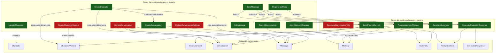

```mermaid
flowchart TB
    subgraph UserInitiated["Casos de uso iniciados por el usuario"]
        direction TB
        UC1[CreateCharacter]:::doc
        UC2[CreateConversation]:::doc
        UC3[SendMessage]:::doc
        UC4[UpdateCharacter]:::doc
        UC5[EditMessage]:::doc
        UC6[RewindConversation]:::doc
        UC7[ApplyMemoryChanges]:::doc
        UC8[CreateCharacterVersion]:::missing
        UC9[ArchiveConversation]:::missing
        UC10[UpdateConversationSettings]:::missing
        UC11[RegenerateReply]:::doc
    end

    subgraph SystemInitiated["Casos de uso iniciados por el sistema"]
        direction TB
        UC12[BuildPromptContext]:::doc
        UC13[GenerateCharacterResponse]:::doc
        UC14[GenerateSummary]:::doc
        UC15[ProposeMemoryChanges]:::doc
        UC16[GenerateConversationTitle]:::missing
    end

    subgraph Entities["Entidades del dominio"]
        Character[Character]
        CharVersion[CharacterVersion]
        CharCard[CharacterCard]
        Conversation[Conversation]
        Message[Message]
        Memory[Memory]
        Summary[Summary]
        PromptContext[PromptContext]
        GeneratedResponse[GeneratedResponse]
    end

    %% Flujo principal
    UC1 -->|crea automáticamente| UC2
    UC1 -->|crea automáticamente| CharVersion
    UC1 -->|crea automáticamente| Conversation
    UC1 -->|crea automáticamente| Message

    UC8 -->|nueva versión| CharVersion
    UC4 -->|modifica| Character

    UC2 --> Conversation
    UC2 --> Message

    UC3 -->|invoca| UC12
    UC3 -->|invoca| UC13
    UC3 -->|invoca| UC14
    UC3 -->|invoca| UC15

    UC12 --> PromptContext
    UC12 --> CharVersion
    UC12 --> CharCard
    UC12 --> Summary
    UC12 --> Memory
    UC12 --> Message

    UC13 --> PromptContext
    UC13 --> GeneratedResponse

    UC14 --> Summary
    UC15 --> Memory
    UC7 -->|aplica cambios| Memory

    UC5 --> Message
    UC6 --> Message
    UC11 -->|re-invoca| UC12
    UC11 -->|re-invoca| UC13

    UC9 --> Conversation
    UC10 --> Conversation

    UC16 --> Conversation

    classDef doc fill:#1b5e20,color:#fff,stroke:#2e7d32
    classDef missing fill:#b71c1c,color:#fff,stroke:#c62828,stroke-dasharray: 5 5
    classDef entity fill:#0d47a1,color:#fff,stroke:#1565c0
```
