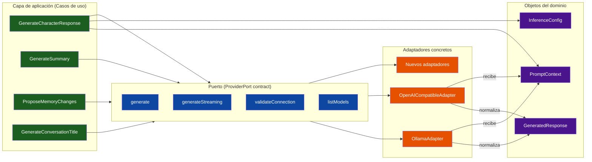

# Arquitectura de Proveedores

## Propósito

Definir cómo el sistema se conecta a modelos de inteligencia artificial de forma completamente agnóstica, permitiendo utilizar distintos proveedores —locales o remotos— sin modificar la lógica de negocio ni los casos de uso.

---

## Principios

* El dominio nunca depende de un proveedor concreto.
* Todo proveedor se integra mediante un adaptador que implementa un contrato común.
* Añadir o sustituir un proveedor no requiere modificar ningún caso de uso.
* La configuración del proveedor pertenece a la conversación o a la configuración global del sistema.
* La respuesta del proveedor siempre se normaliza a objetos del dominio antes de regresar a la capa de aplicación.

---

## Puerto de proveedor (ProviderPort)

El sistema define un contrato abstracto que todo proveedor debe implementar. Este contrato constituye la frontera entre la capa de aplicación y la infraestructura.

### Métodos del contrato

#### generate

Recibe un `PromptContext` y una `InferenceConfig` y devuelve un `GeneratedResponse`.

Este método representa el flujo principal de generación. El sistema envía el contexto completo y espera una respuesta completa del modelo.

El método es asíncrono y puede lanzar errores controlados que el caso de uso solicitante debe manejar.

#### generateStreaming

Recibe un `PromptContext` y una `InferenceConfig` y devuelve un flujo de fragmentos parciales que el sistema puede transmitir al usuario en tiempo real.

Cada fragmento representa una porción incremental del mensaje generado. El sistema ensambla los fragmentos hasta completar la respuesta.

Una vez finalizado el flujo, el sistema construye el `GeneratedResponse` completo a partir del contenido ensamblado.

#### validateConnection

Verifica que el proveedor configurado esté accesible y operativo.

Devuelve un resultado booleano que indica si el proveedor puede recibir solicitudes en este momento.

El sistema puede invocar este método antes de una generación para evitar errores evitables, o periódicamente para mantener actualizado el estado de los proveedores registrados.

#### listModels

Devuelve la lista de modelos disponibles a través del proveedor.

Cada modelo incluye, como mínimo, un identificador único que el sistema utilizará en la configuración de inferencia.

El método puede devolver una lista vacía si el proveedor no soporta el descubrimiento de modelos.

---

## Configuración de inferencia (InferenceConfig)

Cada solicitud de generación incluye una configuración de inferencia que define cómo el modelo debe comportarse durante la generación.

Los parámetros universales que todo proveedor debe soportar son:

| Parámetro | Tipo | Descripción |
|---|---|---|
| `model` | `string` | Identificador del modelo a utilizar |
| `temperature` | `number` | Controla la creatividad de las respuestas |
| `maxTokens` | `number` | Límite máximo de tokens en la respuesta |
| `topP` | `number` | Muestreo por núcleo de probabilidad |
| `frequencyPenalty` | `number` | Penalización por repetición de tokens |
| `presencePenalty` | `number` | Penalización por introducir nuevos tokens |
| `stopSequences` | `string[]` | Secuencias que detienen la generación |

Cada proveedor puede exponer parámetros adicionales específicos, pero los parámetros universales constituyen la base mínima que cualquier conversación puede configurar.

---

## Adaptadores concretos

### OllamaAdapter

Conecta con una instancia local o remota de Ollama.

**Conexión**: mediante HTTP a la URL configurada (por defecto `http://localhost:11434`).

**Modelos**: utiliza los modelos descargados en la instancia de Ollama. El usuario puede seleccionar cualquiera de los disponibles.

**Particularidades**:
* La conexión es local por defecto, pero puede configurarse una URL remota.
* Soporta generación completa y streaming.
* No requiere autenticación en entornos locales.

### OpenAICompatibleAdapter

Conecta con cualquier proveedor que exponga una API compatible con OpenAI (LM Studio, Text Generation WebUI, vLLM, OpenAI, Azure OpenAI, etc.).

**Conexión**: mediante HTTP a la URL base configurada, utilizando la autenticación especificada (API key, token o ninguna).

**Modelos**: varía según el proveedor. Algunos exponen el endpoint de listado de modelos; otros requieren que el usuario especifique manualmente el identificador del modelo.

**Particularidades**:
* La URL base y la API key son parámetros obligatorios de configuración.
* Compatible con cualquier proveedor que implemente el estándar de API de chat de OpenAI.
* Soporta generación completa y streaming.

### Nuevos adaptadores

Para añadir un nuevo proveedor, basta con implementar el contrato `ProviderPort` y registrar el adaptador en el registro de proveedores.

Cada adaptador es responsable de:

1. Traducir el `PromptContext` al formato específico del proveedor.
2. Enviar la solicitud respetando la autenticación y el protocolo del proveedor.
3. Normalizar la respuesta cruda a un `GeneratedResponse` válido.
4. Traducir los errores del proveedor a errores controlados del dominio.

Ningún caso de uso ni entidad del dominio necesita modificarse para incorporar un nuevo proveedor.

---

## Registro de proveedores (ProviderRegistry)

El sistema mantiene un registro central de proveedores disponibles.

### Funcionalidades

* **Registro**: los adaptadores se registran con un identificador único (por ejemplo, `ollama`, `openai-compatible`).
* **Selección por conversación**: cada conversación almacena el proveedor y modelo que debe utilizar. Si no se especifica, se utiliza el proveedor por defecto del sistema.
* **Proveedor por defecto**: el sistema define un proveedor y modelo por defecto que se asignan a las nuevas conversaciones. Esta configuración es global y es definida por el usuario.
* **Estado del proveedor**: el registro puede consultar el estado de cada proveedor (disponible, no disponible, no configurado).

### Configuración global de proveedores

El proveedor por defecto del sistema no es un valor жестido en código, sino una **configuración global** definida y modificable por el usuario.

Su definición reside en `packages/backend/src/infrastructure/config/provider.config.ts`, que persiste la preferencia del usuario en SQLite (tabla `settings`, clave `default_provider`). El archivo expone un servicio de lectura/escritura que los casos de uso consumen sin conocer su implementación concreta.

La configuración global contiene:

* `defaultProvider`: identificador del proveedor por defecto (p. ej. `ollama`, `openai-compatible`).
* `defaultModel`: identificador del modelo por defecto dentro del proveedor seleccionado.

Si el usuario no ha establecido ninguna preferencia, el campo `defaultProvider` permanece vacío y el sistema carece de proveedor por defecto hasta que el usuario lo configure.

### Gestor de proveedores

El sistema proporciona un **gestor de proveedores** accesible desde la interfaz de usuario que permite:

* Listar los proveedores disponibles y su estado.
* Ver los modelos ofrecidos por cada proveedor.
* Seleccionar el proveedor y modelo por defecto del sistema.
* Modificar la selección en cualquier momento.

### Flujo de primera configuración

Dado que el sistema no asume ningún proveedor por defecto, el usuario debe configurarlo antes de poder generar su primera respuesta:

1. Cuando el usuario intenta crear o continuar una conversación y el sistema detecta que no existe proveedor por defecto configurado, el caso de uso **devuelve un error controlado** indicando que no hay proveedor disponible.
2. El frontend, ante este error, presenta al usuario el **gestor de proveedores**.
3. El usuario selecciona un proveedor y un modelo de la lista de disponibles.
4. El sistema persiste la selección como configuración global.
5. La operación interrumpida (creación de conversación o envío de mensaje) puede reintentarse automáticamente o requerir una acción explícita del usuario, según se decida en la implementación de la interfaz.

Este flujo garantiza que el usuario conserve la libertad de elegir y cambiar de proveedor en cualquier momento, respetando el principio de que los modelos son intercambiables.

### Flujo de selección

1. El caso de uso `GenerateCharacterResponse` solicita el proveedor configurado en la conversación.
2. Si la conversación no tiene proveedor configurado, se utiliza el proveedor por defecto del sistema.
3. Si no existe proveedor por defecto configurado en el sistema, se ejecuta el **flujo de primera configuración** descrito anteriormente.
4. Si el proveedor seleccionado no está disponible, el caso de uso devuelve un error controlado sin modificar el estado de la conversación.

---

## Normalización

Cada adaptador es responsable de transformar la respuesta cruda del proveedor en un objeto `GeneratedResponse` válido para el dominio.

### Reglas de normalización

* El mensaje generado es el único campo obligatorio del `GeneratedResponse`.
* La información de uso (tokens de entrada y salida) se incluye si el proveedor la proporciona; en caso contrario se omite.
* Los metadatos específicos del proveedor se incluyen como información opcional sin afectar al dominio.
* Las propuestas de modificación de memoria se extraen de la respuesta si el proveedor y el formato lo soportan, o se solicitan en una llamada separada mediante `ProposeMemoryChanges`.

### Streaming

Durante la generación mediante streaming, el adaptador:

1. Recibe fragmentos parciales del proveedor.
2. Los transmite al caso de uso solicitante para su entrega al usuario.
3. Ensambla el contenido completo a medida que llegan los fragmentos.
4. Al finalizar el flujo, construye el `GeneratedResponse` completo.

---

## Manejo de errores

### Errores de conexión

Si el proveedor no está accesible, el adaptador lanza un error de conexión que el caso de uso `GenerateCharacterResponse` maneja sin modificar el estado de la conversación.

### Errores de generación

Si el proveedor devuelve un error durante la generación (límite de tokens excedido, modelo no encontrado, contenido rechazado), el adaptador traduce el error a un tipo controlado del dominio.

### Timeouts

Cada adaptador define un tiempo máximo de espera para la generación. Si se supera, la operación se cancela y se notifica al caso de uso solicitante.

### Reintentos

El adaptador puede implementar reintentos automáticos ante errores transitorios (timeouts de red, sobrecarga del servidor), pero nunca ante errores de validación (modelo inexistente, configuración inválida).

La política de reintentos debe ser configurable por proveedor.

---

## Consideraciones de seguridad

* Las claves de API y tokens de autenticación se almacenan de forma segura y nunca se incluyen en los registros del sistema.
* Los proveedores locales (Ollama, LM Studio) no requieren autenticación y pueden operar sin conexión a internet.
* Los proveedores remotos requieren conexión a internet y autenticación mediante API key.
* El sistema no comparte información del usuario con proveedores remotos más allá de los mensajes de la conversación y la configuración del personaje, según lo configure el usuario.

---

## Relación con los casos de uso

La arquitectura de proveedores es utilizada directamente por los siguientes casos de uso:

* **GenerateCharacterResponse**: orquesta la llamada al proveedor, coordinando el `ProviderPort` con la configuración de la conversación.
* **GenerateSummary**: utiliza el mismo mecanismo para generar resúmenes narrativos a partir del contexto de la conversación.
* **ProposeMemoryChanges**: utiliza el mismo mecanismo para solicitar al modelo propuestas de modificación de memoria.
* **PromptContextBuilder**: construye el `PromptContext` que será enviado al proveedor, pero no interactúa directamente con él.
* **GenerateConversationTitle**: utiliza el mismo mecanismo para generar títulos descriptivos.

---

## Diagrama de relación

